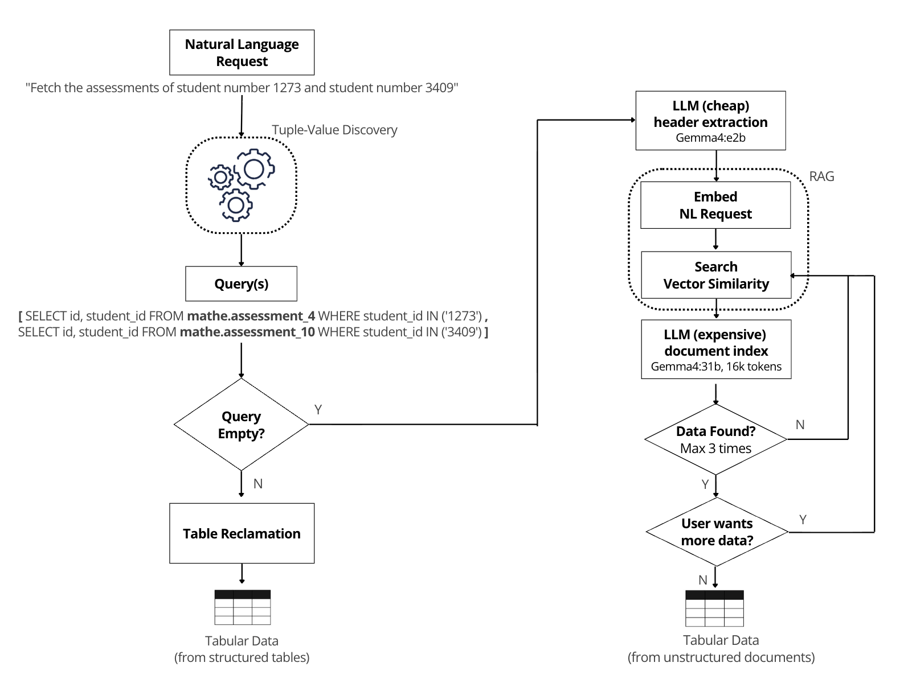

# Table Reclamation & RAG Fallback Demo (`ui_app.py`)

This application is a monolithic, self-contained Streamlit demo that implements a **hybrid tabular data retrieval pipeline**. It attempts to execute structured relational SQL queries when a valid schema mapping exists, and dynamically falls back to an **unstructured RAG (Retrieve-Read-Rerank-Extract)** pipeline using vector search and large language models when structured plans cannot be generated.

---

## Prerequisites & Environment Setup

Before launching the application, ensure your system has the following dependencies running:

1. **PostgreSQL with `pgvector`**
   * A database named `rag` running on `localhost:5432` (or `db_rag:5432` if containerized) containing the embedded document index.
2. **Ollama (Local LLM Server)**
   * Accessible at `http://host.docker.internal:11434` (or localhost).
   * Ensure the following models are pulled:
     * `ollama/gemma4:e2b` (Fast, low-cost schema inference)
     * `ollama/gemma4:31b` (High-accuracy tabular JSON extraction)
     * `ollama/embeddinggemma:300m` (Bi-encoder text embeddings)
3. **Python Virtual Environment**
   * Ensure your `.env` file is present in the project root and all required libraries (`streamlit`, `litellm`, `psycopg`, `pypdf`, `pandas`, `tiktoken`) are installed.

---

## How to Run the Application

If modular imports or facade services break, you can run this self-contained monolithic backup script directly from the project root:

```bash
source .venv/bin/activate; 
streamlit run table_reclamation/ui_app.py;
```

If you want to add a new document, insert the pdf file into data/mathe_unstructured_dataset directory then run this command to add to RAG database.

```bash
python data/rag_generator.py;
```

---

## How It Works

The application processes user queries through a **4-stage progressive pipeline**:


```
                       [ 1. Natural Language Query ]
                                    │
                       [ 2. Lexicon Parse -> UR ]
                                    │
                       [ 3. Access Plan Generation ]
                                    │
                      Is SQL Plan (`plan`) generated?
                     /                               \
              [ YES ]                                 [ NO ]
      BRANCH A: SQL Plan Execution            BRANCH B: RAG Extraction
       • Execute Relational SQL                • pgvector Semantic Retrieval
       • Display Structured DataFrame          • Schema Inference (e2b Model)
       • EPrune Result Trimming                • Batch Likelihood Estimation
                                               • 3-Doc Iterative Search (31b Model)
```

---

### Section 1 & 2: Natural Language to User Request (UR)
* **Query Parsing:** The user enters a natural language query (e.g., *"Need Discrete Mathematics, Recursivity, level 2"*).
* **Lexicon Mapping:** Clicking **Parse NL → UR** matches terms against `lexicon.json` to generate a structured JSON representation of the User Request (`UR`).
* **State Reset:** Parsing a new query automatically purges old execution plans, dataframes, and RAG pagination counters from Streamlit's `st.session_state`.

---

### Section 3: Access Plan (AP) Generation & Branch Routing
Clicking **Generate AP** attempts to construct a sequence of SQL queries (`AP_plan`) based on dataset statistics (`stats.parquet` and `value_index.json`).

| Condition | Selected Branch | Mode Triggered |
| :--- | :--- | :--- |
| **`plan` is non-empty** | **Branch A: SQL Execution** | `rag_mode = False` |
| **`plan` is empty (`[]`)** | **Branch B: RAG Fallback** | `rag_mode = True` |

---

### Section 4: Execution Branches

#### Branch A: SQL Plan Execution (`rag_mode = False`)
When a deterministic database path exists:
1. **Plan Display:** Shows the generated SQL statements for each target table.
2. **Execution:** Clicking **Execute AP** runs the queries against the structured dataset splits and outputs a clean Pandas DataFrame.
3. **Pruning:** Clicking **Prune Result** applies `EPrune` to strip out superfluous rows and columns not explicitly requested in the UR.

#### Branch B: RAG Unstructured Extraction (`rag_mode = True`)
When no structured SQL table matches the request, the app falls back to unstructured PDF processing:

1. **Semantic Vector Search:**
   * Embeds the user's query using `embeddinggemma:300m`.
   * Queries PostgreSQL (`pgvector`) using the cosine distance operator (`<->`) to retrieve the top 50 closest PDF filenames and their geometric distances.
2. **Canonical Schema Inference (Cheap LLM):**
   * Uses `gemma4:e2b` at `temperature=0` to inspect the query and output the required column headers as a JSON schema (e.g., `["student_id", "assessment_score"]`).
3. **Batch Probability Likelihood Estimator:**
   * Before executing heavy extraction, the app calculates the likelihood that the next batch of 3 documents contains the target data.
   * Cosine distance $d_i$ is converted into an individual document hit probability $p_i$ using an exponential decay model with decay rate $\lambda=3.5$:
     $$p_i=\max(0.01,\min(0.99,e^{-\lambda d_i}))$$
   * The cumulative probability of finding **at least one relevant table row** across the batch of 3 documents is computed via the complement rule:
     $$P(\text{batch hit})=1-\prod_{i=1}^{3}(1-p_i)$$
   * Displays a visual progress bar and a percentage badge in the UI so the user can gauge if deeper searching is worthwhile.
4. **Interactive Batch Extraction (Expensive LLM):**
   * Clicking **Search Next 3 Documents** reads the raw text from the next 3 PDF files in `mathe_unstructured_dataset/`, chunking them into 16,384-token windows.
   * Passes each chunk to `gemma4:31b` with strict instructions to output valid JSON rows matching the inferred headers.
   * **Short-Circuiting & Deduplication:** As soon as valid rows are found in a document, the loop short-circuits, deduplicates the tuples on the fly (`list({tuple(row) ...})`), appends them to the results table, and refreshes the UI.